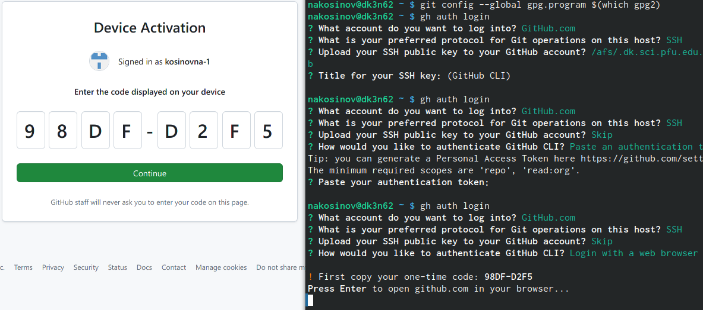

---
## Front matter
title: "РУДН. Операционные системы"
subtitle: "Отчёт по лабораторной работе №2"
author: "Косинов Никита Андреевич, НПМбв-02-20"

## Generic otions
lang: ru-RU
toc-title: "Содержание"

## Bibliography
bibliography: bib/cite.bib
csl: pandoc/csl/gost-r-7-0-5-2008-numeric.csl

## Pdf output format
toc: true # Table of contents
toc-depth: 2
lof: true # List of figures
lot: true # List of tables
fontsize: 12pt
linestretch: 1.5
papersize: a4
documentclass: scrreprt
## I18n polyglossia
polyglossia-lang:
  name: russian
  options:
	- spelling=modern
	- babelshorthands=true
polyglossia-otherlangs:
  name: english
## I18n babel
babel-lang: russian
babel-otherlangs: english
## Fonts
mainfont: PT Serif
romanfont: PT Serif
sansfont: PT Sans
monofont: PT Mono
mainfontoptions: Ligatures=TeX
romanfontoptions: Ligatures=TeX
sansfontoptions: Ligatures=TeX,Scale=MatchLowercase
monofontoptions: Scale=MatchLowercase,Scale=0.9
## Biblatex
biblatex: true
biblio-style: "gost-numeric"
biblatexoptions:
  - parentracker=true
  - backend=biber
  - hyperref=auto
  - language=auto
  - autolang=other*
  - citestyle=gost-numeric
## Pandoc-crossref LaTeX customization
figureTitle: "Рис."
tableTitle: "Таблица"
listingTitle: "Листинг"
lofTitle: "Список иллюстраций"
lotTitle: "Список таблиц"
lolTitle: "Листинги"
## Misc options
indent: true
header-includes:
  - \usepackage{indentfirst}
  - \usepackage{float} # keep figures where there are in the text
  - \floatplacement{figure}{H} # keep figures where there are in the text
---

# Цель работы

При работе большой команды людей над некоторым проектом неизменно возникают ситуации с накопленными одновременно изменениями. Для решения этой проблемы разработаны различные систимы контроля версий проектов, чтобы любой член комманды вовремя получал изменения проекта и мог их учитывать.

Цель данной работы - приобретение теоретических и практических навыков по работе с системой контроля версий на примере **Git**.

# Ход работы

Лабораторная работа выполнена в терминале **OC Linux** и хостинге хранения проектов **Github** с использованием **VCS Git**.
Действия по лабораторной работе представлены в следующем порядке:
1. Настройка **git** и учётной записи **github**;
2. Создание рабочего пространства;
3. Самостоятельная работа.

# Настройка **github** и **git**

Настраиваем рабочий репозиторий и предварительную конфигурацию Git.

1. У нас уже есть учётная запись на сайте **github**, так что сразу переходим к настройке репозитория и связи его с глобальным. Указываем имя пользователя и свой **e-mail**. Настраиваем также **utf-8** и верификайцию.

{#fig:fig1 width=70%}

2. Создаём пару **SSH**-ключей: публичный и приватный. Публичный - чтобы другие узлы видели нашу работу, приватный - чтобы определить узел, из которого мы будем работать.

{#fig:fig2 width=70%}

{#fig:fig3 width=70%}

3. Привязываем созданный по алгоритму **ed25519** ключ к своему аккаунту на **GitHub**

{#fig:fig8 width=70%}

{#fig:fig9 width=70%}

3. Генерируем **GPG**-ключ для корректной работы коммитов. Указываем необходимую конфигурацию, своё полное имя и почту. Дополнительный пароль для защиты не ставим.

{#fig:fig5 width=70%}

{#fig:fig6 width=70%}

4. Выводим отпечаток ключа. По нему копируем сам ключ для дальнейшей привязке к своему аккаунту на **GitHub**.

{#fig:fig7 width=70%}

{#fig:fig10 width=70%}

5. Включаем режим бдительности для отслеживания неподписанных комминтов

{#fig:fig11 width=70%}

6. Настраиваем автоматические подписи коммитов и настраиваем **gh**.

{#fig:fig12 width=70%}

{#fig:fig13 width=70%}

{#fig:fig14 width=70%}

# Создание структурированного пространства для работы

С помощью терминала и интерфейса **github** создаём удобную для чтения и работы файловую систему будущих лабораторных работ.

1. Создаём папку для предмета “Операционные системы” командой **mkdir** с использованием ключа **p** для одновременного создания вложенных папок. Переходим в созданную папку и копируем шаблон репозитория пользователя **yamadharma**.

{#fig:fig15 width=70%}

{#fig:fig16 width=70%}

2. Проверяем, что всё заработало успешно

{#fig:fig17 width=70%}

3. Удаляем лишние папки из шаблона, создаём необходимые, а также заливаем изменения на репозиторий, сдела коммит **make course structure**.

{#fig:fig18 width=70%}

4. После завершения отчёта плнируем также загрузить его на репозиторий

# Контрольные вопросы

1. Система контроля версий (**Version Control System, VCS**) - это программное обеспечение для отслеживания изменений в документах, что обеспечивает удобную работу с нескольких устройств и, возможно, несколькими разработчиками. **VCS** также позволяет фиксировать версии, делать откаты на более ранние, разрешать конфликты изменений, следить, кто именно внёс и какие исправления и т.п.

2. Хранилище - место, где располагается проект. 
Commit - это способ сохранять изменения. 
История в Git - это место хранения всех сделанных commit-ов. 
Рабочая копия - это "снимок" одной из версий проекта, с которым можно работать на локальном компьютере.

3. Централизованная VCS - это клиент-серверское приложение, когда проект существует в единственном экземпляре и хранится в общедоступном месте - сервере. Примеры: CVS, SVN.
Децентрализованная (распределённая) VCS - приложение, позволяющее хранить копию проекта у каждого разработчика, работающего с ним. При этом есть место хранения всех изменений проекта. Примеры: Mercurial, Git.

# Выводы

В данной лабораторной работе мы узнали о способе бесконфликтного одновременного изменения проекта с использованием средств контроля версий на примере **VCS Git**. Поняли, как связывать глобальный репозиторий с локальными его копиями, с каждой из которых работает отдельный разработчик, загружать изменения и указывать на них.

[@tanenbaum_book_modern-os_ru].

::: {#refs}
:::
