---
## Front matter
title: "РУДН. Операционные системы"
subtitle: "Отчёт по лабораторной работе №4"
author: "Косинов Никита Андреевич, НПМбв-02-20"

## Generic otions
lang: ru-RU
toc-title: "Содержание"

## Bibliography
bibliography: bib/cite.bib
csl: pandoc/csl/gost-r-7-0-5-2008-numeric.csl

## Pdf output format
toc: true # Table of contents
toc-depth: 2
lof: true # List of figures
lot: true # List of tables
fontsize: 12pt
linestretch: 1.5
papersize: a4
documentclass: scrreprt
## I18n polyglossia
polyglossia-lang:
  name: russian
  options:
	- spelling=modern
	- babelshorthands=true
polyglossia-otherlangs:
  name: english
## I18n babel
babel-lang: russian
babel-otherlangs: english
## Fonts
mainfont: PT Serif
romanfont: PT Serif
sansfont: PT Sans
monofont: PT Mono
mainfontoptions: Ligatures=TeX
romanfontoptions: Ligatures=TeX
sansfontoptions: Ligatures=TeX,Scale=MatchLowercase
monofontoptions: Scale=MatchLowercase,Scale=0.9
## Biblatex
biblatex: true
biblio-style: "gost-numeric"
biblatexoptions:
  - parentracker=true
  - backend=biber
  - hyperref=auto
  - language=auto
  - autolang=other*
  - citestyle=gost-numeric
## Pandoc-crossref LaTeX customization
figureTitle: "Рис."
tableTitle: "Таблица"
listingTitle: "Листинг"
lofTitle: "Список иллюстраций"
lotTitle: "Список таблиц"
lolTitle: "Листинги"
## Misc options
indent: true
header-includes:
  - \usepackage{indentfirst}
  - \usepackage{float} # keep figures where there are in the text
  - \floatplacement{figure}{H} # keep figures where there are in the text
---

# Цель работы

Одним из важных навыков при работе с ЭВМ является умение общаться с компьютером посредством терминала - это позволяет производить не только действия, доступные из графического интерфейса, но и отлаживать неисправности, протестировать приложеине, настроить удалённый сервер и многое другое.

Цель данной работы - приобретение теоретических и практических навыков по работе с командной строкой на примере ОС **Linux**.

# Ход работы

Лабораторная работа выполнена в терминале **OC Linux** и хостинге хранения проектов **Github**.
Действия по лабораторной работе представлены в следующем порядке:
1. Навигация посредством командной строки;
2. Создание,удаление каталогов;
3. Использование команды *man*;
4. Контрольные вопросы.

# Навигация посредством командной строки**

Выполняем задание по навигации, используя терминал.

1. Открываем терминал. Мы оказываемся в домашней директории, что видно из её названия и символа **~**. Определим полный путь до неё командой *pwd*.

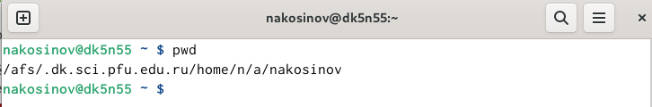{#fig:fig1 width=70%}

2. Переходим в каталог **/tmp** и просматриваем файлы в нём командой *ls*.

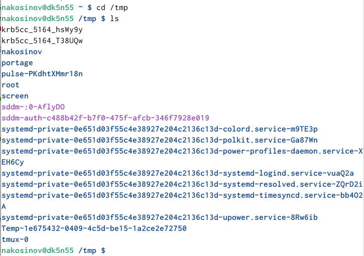{#fig:fig2 width=70%}

3. Попробуем различные опции команды *ls*. Опция *-a* выводит также скрытые файлы, опция *-l* отображает подробную информацию о содержимом каталогов.

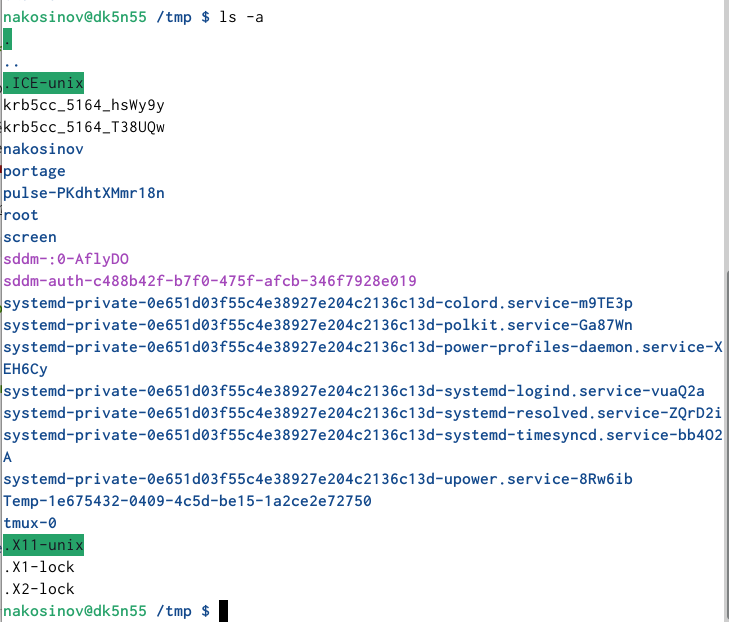{#fig:fig3 width=70%} 

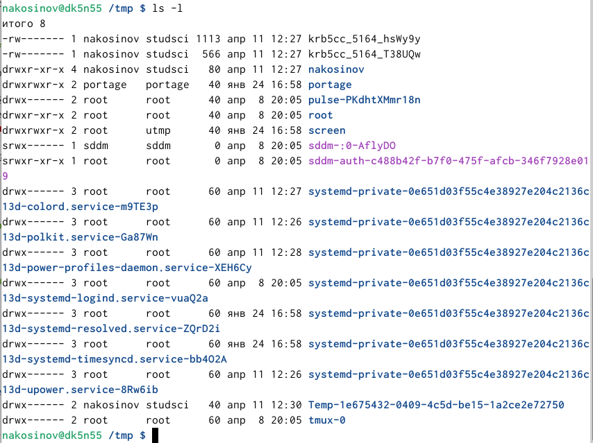{#fig:fig4 width=70%}

4. Опции команд можно комбинировать. Для этого достаточно записать их подряд.

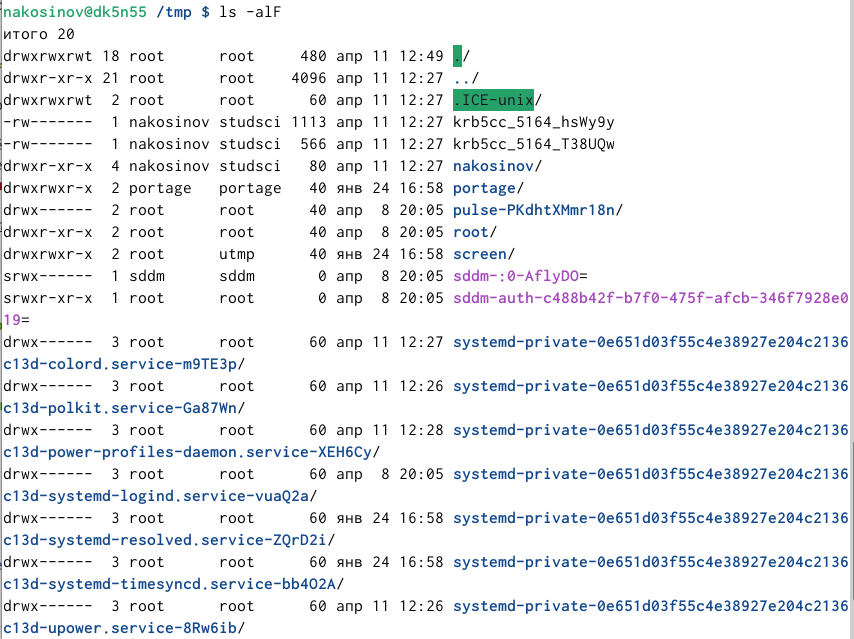{#fig:fig5 width=70%}

5. Определим, есть ли в каталоге **/var/spool** подкаталог **cron**. Можно просто применить команду *ls* с добавлением пути на этот каталог и просмотреть содержимое, но если его много, то можно попытаться пройти в искомую. Если получится, то она есть.

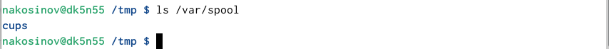{#fig:fig6 width=70%}

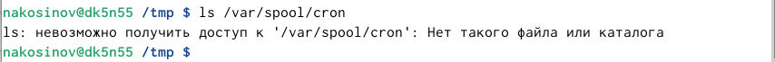{#fig:fig7 width=70%}

6. Перейдём в домашнюю директорию, используя сокращённый путь **~**.

{#fig:fig8 width=70%}

7. Для просмотра содержимого и определения владельца, выполним команду *ls* с опцией *-l*. Мы видим, что владельцем является пользователь *nakosinov*.

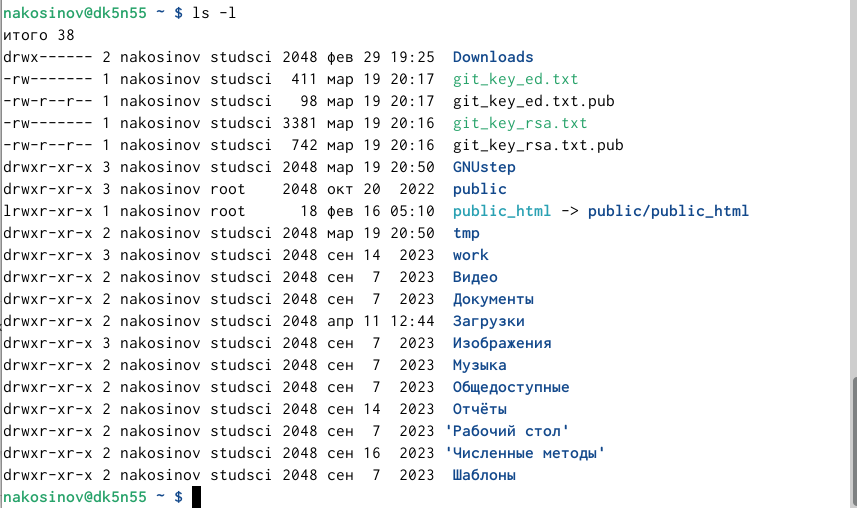{#fig:fig9 width=70%}

#Создание/удаление каталогов

Также необходимо уметь создавать новые объекты и управлять ими из терминала. В рамках данного задания, мы научимся создавать и удалять новые каталоги.

1. Создаём в домашней папке подкаталог **newdir** командой *mkdir*.

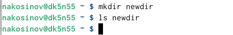{#fig:fig11 width=70%}

2. Создаём в **newdir** папку **morefun**, указывая явный путь к ней, а не переходя внутрь каталога.

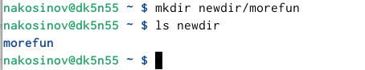{#fig:fig12 width=70%}

3. Создаём три папки одной командой. Для этого достаточно указать их названия через пробел.

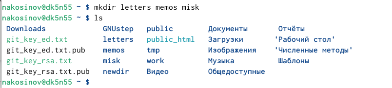{#fig:fig13 width=70%}

4. Удаляем три созданных директории, также одной командой. Раз они являются каатлогами, используем команду *rmdir*.

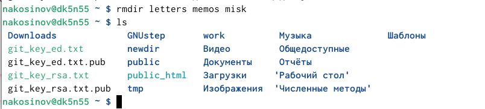{#fig:fig14 width=70%}

5. В предыдущем пункте мы удаляли каталоги командой *rmdir*. Если попробовать удалить каталог командой *r*, то терминал "заругается". Действительно, *rm* позволяет удалить 

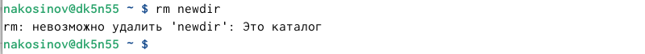{#fig:fig15 width=70%}

6. Действительно, *rm* позволяет удалить какой-то один объект, а в каталоге могут лежать следующие. Поэтому, чтобы удалить папку со всем её содержимым, нужно добавить опцию *-r* для каскадного удаления объектов.

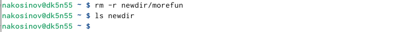{#fig:fig16 width=70%}

# Использование команды man

Для упрощения работы с терминалом существует специальная команда *man*, позволяющая получить информацию о других командах, в частности, об их возможных опциях.

1. Изучим команду *ls* с помощью *man*. Нам откроется некотоорая документация интересующей команды.

{#fig:fig19 width=70%}

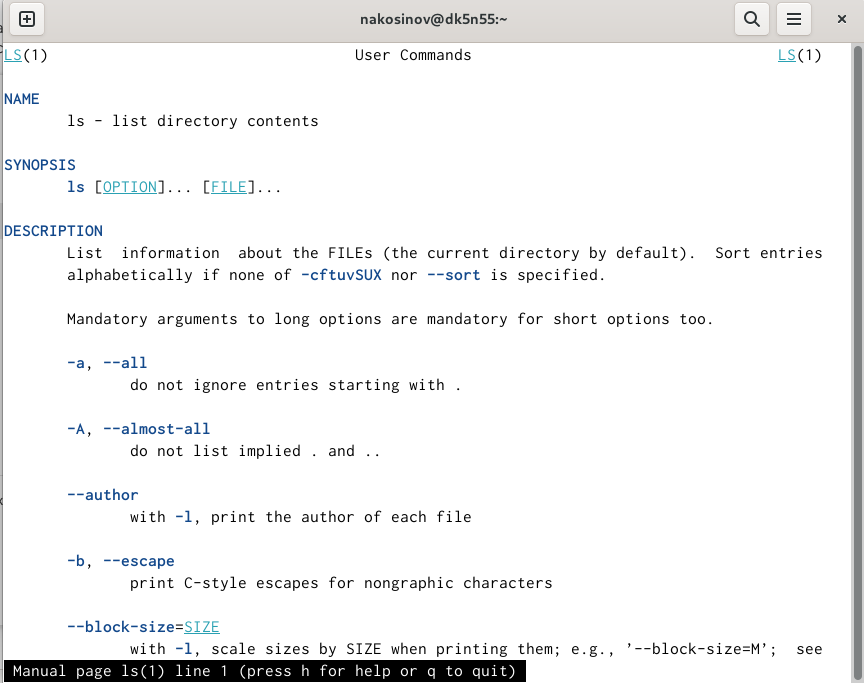{#fig:fig17 width=70%}

2. Читая открытую документацию, ищем опцию, позволяющую рекурсивно просматривать всё содержимое каталога, включая его подкаталоги. Это опция *-R*.

{#fig:fig18 width=70%}

3. Проверяем корректность выполнения задания на примере папки **work**

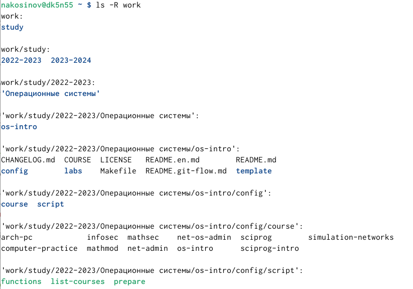{#fig:fig20 width=70%}

4. В той же документации находим набор опций, сортирующих содержимое по времени изменения. Это опция *-c* с возможными добавками *-lt* и *-l*.

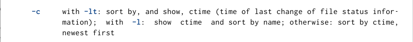{#fig:fig21 width=70%}

5. Проверяем корректность выполнения задания на примере папки **report** предыдущей лабораторной работы.

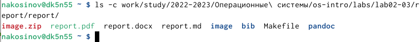{#fig:fig22 width=70%}

6. Изучим команды *cd*, *pwd*, *mkdir*, *rmdir*, *rm* на предмет их опций, перечислим некоторые из них.

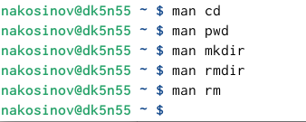{#fig:fig28 width=70%}

7. Команда *cd* имеет следующие основные опции: *-L* для перехода по символическим ссылкам (стоит по умолчанию) и *-P* для разыменовывания символической ссылки.

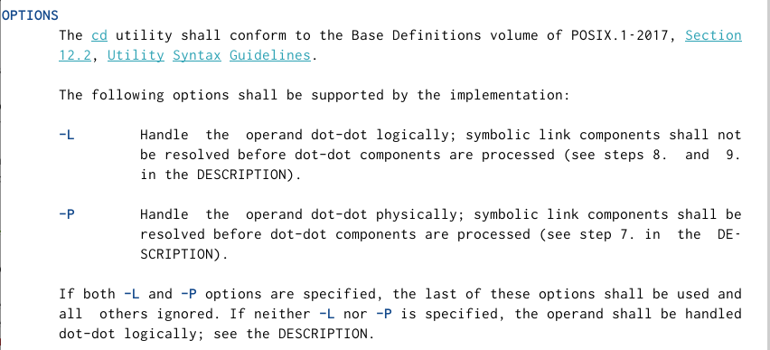{#fig:fig23 width=70%}

8. Основные опции *pwd*: *-L* - для взятия директории из окружения, *-P* - чтобы отбросить все символические ссылки.

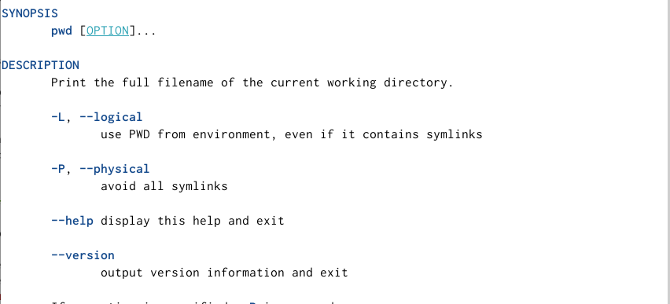{#fig:fig24 width=70%}

9. Основные опции команды *mkdir*: *-p* для создания вложенных каталогов, *-v* для выводе информации о новом каталоге, *-m* для установления *chmod*.

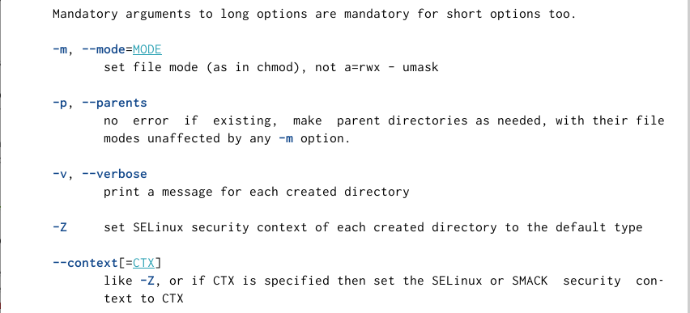{#fig:fig25 width=70%}

10. Опции *rmdir*: *-p* используется для каскадного удаления родительских директорий, если те остаются пустыми, *-v* выводит информацию об удалении, *--ignore-fail-on-non-empty* позволяет игнорировать возникающие ошибки при наличии файлов в каталоге.

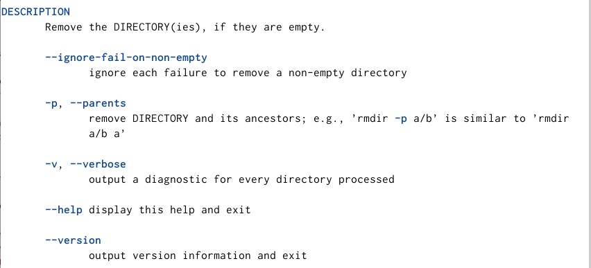{#fig:fig26 width=70%}

11. Опции *rm*: *-f* для игнорирования несуществующих файлов, *-i* для вывода запроса на подтверждение удаления для каждого файла, *-I* для запроса об удалении сразу всех файлов.

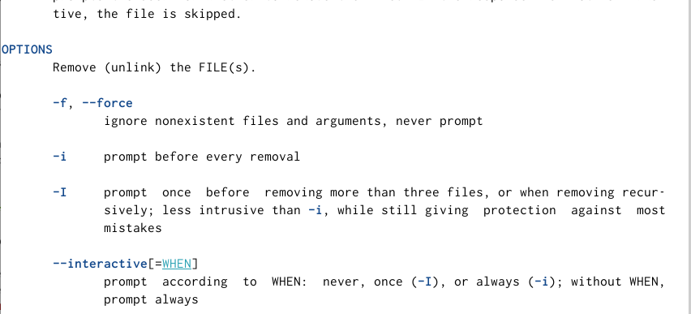{#fig:fig27 width=70%}

12. Выведем историю команд с помощью *history*.

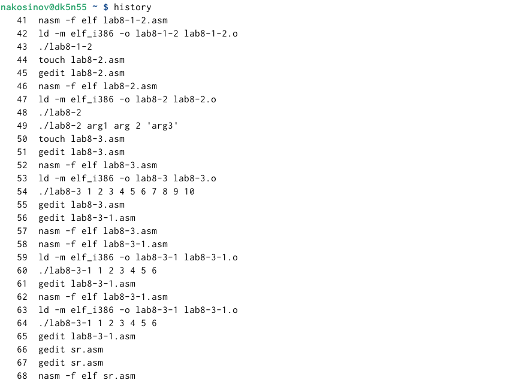{#fig:fig30 width=70%}

13. Вызовем некоторые исз последних с модификатором. Команду 519 - *mkdir*, изменим, чтобы она создавала новый каталог. Команде 520 - *ls*, попробуем добавить опцию, команде 515 - *cd*, изменим путь. Запустим через **;**. Первая и третья оманда исполнились без ошибок, однако вторая не поняла наших намерений, ведь опция до этого не использовалась. Соответственно, чтобы это сработало, нам нужно по другому передавать "что менять".

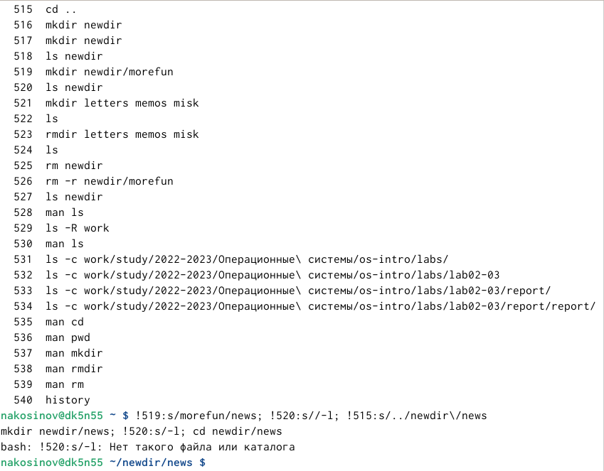{#fig:fig31 width=70%}

14. Выполним команду 515 - *cd*, с другим модификатором - чтобы прописать специальный символ **/**, использоем экранирование: **\\**.

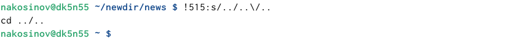{#fig:fig32 width=70%}

15. По обыкновению, заливаем все сделанные изменения и это отчёт на репозиторий в **github**.

# Контрольные вопросы

1. Терминал - это устройство для ввода и вывода информации, команд и сообщений.

2. Абсолютный путь до текущего каталога можно узнать командой *pwd*.

3. Только тип и имена файлов и каталогов можно получить командой *ls* с опцией *-F*. При этом в конце имени каждого объекта будет стоять специальный символ: **/**, если это каталог, **\**, если это файл, и **@**, если это ссылка.

4. Информацию о скрытых файлах можно отбразить командой *ls* с опцией *-a*.

5. Файл можно удалить командой *rm*. Каталог можно удалить командой *rmdir*. Для каскадного удаления непустого каталога следует прописать *rm -r*.

6. Последние команды пользователя можно посмотреть в буфере командой *history*.

7. Вызов команды с номером *N* происходит командой *!N*. Для вызова с модификацией (изменением) следует написать *!N:s/<старое значение>/<новое значение>*.

8. Для запуска нескольких команд в одной строке необходимо прописать их через **;**. Например:

*cd ..; !233:s/a/l; mkdir new/teg; ls new*

9. Символ экоанирования - обратный слэш для модификатора команд - необходим, чтобы печатать непосредственно специальные символы, при этом не давая терминалу "разглядеть" в них команды.

10. Опция *l* команды *ls* позволяет отобразить полную информацию о файлах и подкаталогах.

11. Относительный путь - расположение объекта относительно текущей директории. Абсолютный путь - путь относительно корня. Пример: *cd ../new* переходит в папку того же уровня с помощью относительного пути, а *cd /<получить с помощью pwd>/new* - то же с помощью абсолютного пути.

12. Интересующую команду *command* можно изучить, вызвав в терминале документацию этой команды: *man command*.

13. Для автоматического дополнения команд можно использовать клавишу **Tab**.

# Выводы

Терминал предоставляет пользователю возможность выполнения различных операций и управления компьютером или сервером без необходимости использования графического интерфейса.

