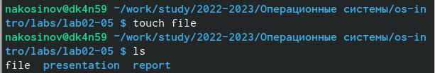
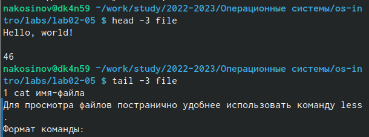
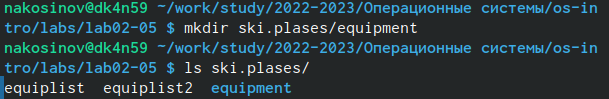
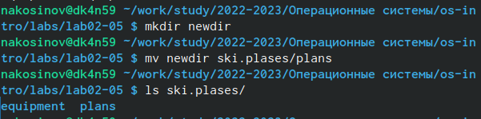
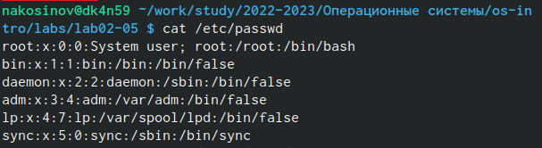

---
## Front matter
title: "РУДН. Операционные системы"
subtitle: "Отчёт по лабораторной работе №5"
author: "Косинов Никита Андреевич, НПМбв-02-20"

## Generic otions
lang: ru-RU
toc-title: "Содержание"

## Bibliography
bibliography: bib/cite.bib
csl: pandoc/csl/gost-r-7-0-5-2008-numeric.csl

## Pdf output format
toc: true # Table of contents
toc-depth: 2
lof: true # List of figures
lot: true # List of tables
fontsize: 12pt
linestretch: 1.5
papersize: a4
documentclass: scrreprt
## I18n polyglossia
polyglossia-lang:
  name: russian
  options:
	- spelling=modern
	- babelshorthands=true
polyglossia-otherlangs:
  name: english
## I18n babel
babel-lang: russian
babel-otherlangs: english
## Fonts
mainfont: PT Serif
romanfont: PT Serif
sansfont: PT Sans
monofont: PT Mono
mainfontoptions: Ligatures=TeX
romanfontoptions: Ligatures=TeX
sansfontoptions: Ligatures=TeX,Scale=MatchLowercase
monofontoptions: Scale=MatchLowercase,Scale=0.9
## Biblatex
biblatex: true
biblio-style: "gost-numeric"
biblatexoptions:
  - parentracker=true
  - backend=biber
  - hyperref=auto
  - language=auto
  - autolang=other*
  - citestyle=gost-numeric
## Pandoc-crossref LaTeX customization
figureTitle: "Рис."
tableTitle: "Таблица"
listingTitle: "Листинг"
lofTitle: "Список иллюстраций"
lotTitle: "Список таблиц"
lolTitle: "Листинги"
## Misc options
indent: true
header-includes:
  - \usepackage{indentfirst}
  - \usepackage{float} # keep figures where there are in the text
  - \floatplacement{figure}{H} # keep figures where there are in the text
---

# Цель работы

Файловая структура - основной инструмент навигации на компьютере. Он упрощает поиск, хранение, работу с данными. Изменяя права доступа, можно защитить файлы от фатального изменения, или данные пользователя. 

Цель данной работы - приобретение теоретических и практических навыков по работе с файловой ситемой из командной строки на примере ОС **Linux**.

# Ход работы

Лабораторная работа выполнена в терминале **OC Linux** и хостинге хранения проектов **Github**.
Действия по лабораторной работе представлены в следующем порядке:
1. примеры создания и чтения файлов из командной строки;
2. работа с файловой системой;
3. определение и изменение прав доступа;
4. самостоятельная работа.

По завершении отчёта, вся рабочая папка отправляется на репозиторий на *github*.

# Примеры создания и чтения файлов из командной строки

Перед началом работы, по обычаю, получим обновления из **git** командой *git pull*, и создадим рабочую папку **lab02-05** командой *mkdir*.

Выполняем примеры из лабораторной работы.

1. Создаём новый документ **file** командой *touch*. Проверяем, что документ появился командой *ls*.

{#fig:fig1 width=70%}

2. Запишем что-нибудь в файл для дальнейших экспериментов.

{#fig:fig2 width=70%}

3. Просмотирм содержимое командой *cat*.

{#fig:fig3 width=70%}

4. Просмотрим содержимое документа командой *less*.

{#fig:fig5 width=70%}

{#fig:fig4 width=70%}

5. Немного подредактировав документ **file**, выведем его первые 3 и последние 3 строки.

{#fig:fig6 width=70%}

# Работа с файловой системой

Данная часть работы посвящена редактированию файловой структуры посредством консоли.

1. Копируем командой *cp* файл **io.h** в текущую рабочую директорию, меняя его название на **equipment**.

{#fig:fig7 width=70%}

2. Создаём новую папку в текущем каталоге командой *mkdir*.

{#fig:fig8 width=70%}

3. Перемещаем ранее скопированный файл **equipment** в новый каталог с помощью команды *mv*.

{#fig:fig9 width=70%}

4. Переименуем этот файл в **equiplist**, используя ту же команду *mv*.

{#fig:fig10 width=70%}

5. Создадим новый файл **abc1** командой *touch*. Скопируем его командой *cp* в каталог **ski.plases**, одновременно переименовывая в **equiplist2**. Сразу проверим корректность выполнения командой *ls*.

{#fig:fig11 width=70%}

6. Создадим новый каталог **equipment** командой *mkdir* с указанием относительного пути.

{#fig:fig12 width=70%}

7. Переместим файлы из **ski.plases** в новую директорию одной командой *mv* с последовательным перечислением.

{#fig:fig13 width=70%}

8. Создадим новый каталог **newdir**. Переместим его внутрь другого каталога.

{#fig:fig14 width=70%}

# Определение и изменение прав доступа

У каждого объекта: файла или каталога, есть определённая настройка прав доступа. Различают три вида пользователей: **u** - владелец файла, **g** - группа владельца, **o** - все остальные. Для каждого вида отдельно в строчку указывается, что он может, а что не может делать с объектом: читать, записывать и выполнять.

1. Создаём новые документы **file** командой *touch* для дальнейших эксперементов.

{#fig:fig15 width=70%}

2. Посмотрим текущие права доступа файла **australia**. Видим строчку *rw-r--r--*, что означет, что у **u**  есть право на чтение и запись, у **g** и **o** - только на чтение. Добавим владельцу файла право на выполнение объекта - **x**.

{#fig:fig16 width=70%}

3. Аналогично поступим с документами **play**, **my_os** и **feathers**. Например, для документа **play** добавим всем право на исполниение, но отменим *группе* и *остальным* право на чтение. 

{#fig:fig17 width=70%}

{#fig:fig18 width=70%}

{#fig:fig19 width=70%}

# Самостоятельная работа

Выполним несколько упражнений самостоятельно.

1. Командой *cat* росмотрим содержимое файла **passwd** из каталога **/etc**.

{#fig:fig20 width=70%}

2. Командой *cp* скопируем файл, оставив в той же директории.

{#fig:fig21 width=70%}

3. Командой *mv* переместим скопированный файл в другой каталог.

{#fig:fig22 width=70%}

4. Командой *cp* с использованием ключа **-r** скопируем каталог **play** со всем его содержимым.

{#fig:fig23 width=70%}

5. Командой *mv* перемещаем скопированный каталог с изменением имени.

{#fig:fig24 width=70%}

6. Командой *chmod* с опцией *u-r* лишаем владельца файла прав на чтение. Проверяем корректность работы командой *ls* с ключом *-l*.

{#fig:fig25 width=70%}

7. Если попытаться просмотреть содержимое командой *cat* файл с запретом на чтение, то просмотреть не удастся. То же и с попыткой копирования командой *cp*.

{#fig:fig26 width=70%}

{#fig:fig27 width=70%}

8. Командой *chmod* с опцией *u+r* вернём владельцу файла права на чтение.

{#fig:fig28 width=70%}

9. Лишим владельца прав доступа на выполнение каталога **play**. В этом случае при попытке перейти в каталог, попытка увенчается успехом, ведь права на чтение сохранены.

{#fig:fig29 width=70%}

{#fig:fig31 width=70%}

{#fig:fig30 width=70%}

10. Просмотрим некоторые команды с помощью *man*. Из описанного там можно сделать выводы, что:
* команда **mount** позволяет изучить используемые файловые системы и примонтированные устройства;
* команда **fsck** позволяет мониторить корректность работы файловой ситемы;
* команда **mkfs** используется для создания новой файловой системы на хард-диске или флеш-накопителе;
* команда **kill** завершет исполняемые процессы, не зависимо от стадии их работы, что позволяет, например, разгрузить эвм.

{#fig:fig32 width=70%}

# Выводы

Терминал предоставляет пользователю возможность выполнения различных операций по управлению файловой системой: создание, перемещение объектов, изменение их прав доступа, просмотр общей информации о ФС.

