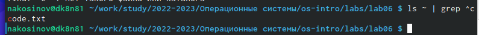
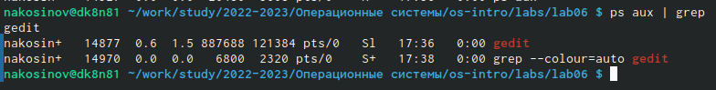
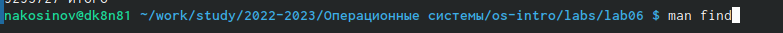
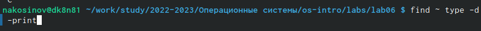

---
## Front matter
title: "РУДН. Операционные системы"
subtitle: "Отчёт по лабораторной работе №6"
author: "Косинов Никита Андреевич, НПМбв-02-20"

## Generic otions
lang: ru-RU
toc-title: "Содержание"

## Bibliography
bibliography: bib/cite.bib
csl: pandoc/csl/gost-r-7-0-5-2008-numeric.csl

## Pdf output format
toc: true # Table of contents
toc-depth: 2
lof: true # List of figures
lot: true # List of tables
fontsize: 12pt
linestretch: 1.5
papersize: a4
documentclass: scrreprt
## I18n polyglossia
polyglossia-lang:
  name: russian
  options:
	- spelling=modern
	- babelshorthands=true
polyglossia-otherlangs:
  name: english
## I18n babel
babel-lang: russian
babel-otherlangs: english
## Fonts
mainfont: PT Serif
romanfont: PT Serif
sansfont: PT Sans
monofont: PT Mono
mainfontoptions: Ligatures=TeX
romanfontoptions: Ligatures=TeX
sansfontoptions: Ligatures=TeX,Scale=MatchLowercase
monofontoptions: Scale=MatchLowercase,Scale=0.9
## Biblatex
biblatex: true
biblio-style: "gost-numeric"
biblatexoptions:
  - parentracker=true
  - backend=biber
  - hyperref=auto
  - language=auto
  - autolang=other*
  - citestyle=gost-numeric
## Pandoc-crossref LaTeX customization
figureTitle: "Рис."
tableTitle: "Таблица"
listingTitle: "Листинг"
lofTitle: "Список иллюстраций"
lotTitle: "Список таблиц"
lolTitle: "Листинги"
## Misc options
indent: true
header-includes:
  - \usepackage{indentfirst}
  - \usepackage{float} # keep figures where there are in the text
  - \floatplacement{figure}{H} # keep figures where there are in the text
---

# Цель работы

В прошлой лабораторной работе мы познакомились со структурой файловой системы. Кроме открытия, чтения и работы с правами доступа необходимо быстро находить необходимые документы, и знать, как их записывать, какие команды и как можно применять к дереву каталогов.

Цель данной работы - приобретение теоретических и практических навыков по работе с файловой ситемой из командной строки на примере ОС **Linux**.

# Ход работы

Лабораторная работа выполнена в терминале **OC Linux** и хостинге хранения проектов **Github**.
Действия по лабораторной работе представлены в следующем порядке:

1. перенаправление ввода-вывода;

2. фильтрация текста;

3. поиск файла;

4. обработка информации о процессах.

По завершении отчёта, вся рабочая папка отправляется на репозиторий на *github*.

# Перенаправление ввода-вывода

Перед началом работы, по обычаю, получим обновления из **git** командой *git pull*, и создадим рабочую папку **lab02-06** командой *mkdir*.

{#fig:fig1 width=70%}

Выполняем примеры из лабораторной работы по перенаправлению вывода.

1. Записываем все файлы, содержащиеся в каталоге **/etc**, используя стандартную команду *ls* вывода содержимого с применением перенаправления записи *>* в файл **file.txt**.

{#fig:fig2 width=70%}

2. Просмотрим полученный результат командой *cat*.

{#fig:fig4 width=70%}

{#fig:fig3 width=70%}

3. Дозапишем в тот же файл все файлы из домашней директории. Для дозаписи используем команду *>>*

{#fig:fig5 width=70%}

4. Просмотрим содержимое, чтобы убедиться, что команда выполнена корректно.

{#fig:fig6 width=70%}

# Фильтрация текста

Данная часть работы посвящена поиску файлов с определёнными текстовыми маркерами.

1. Командой *grep* ищем в недавно созданном **file.txt** все файлы с расширением **.conf**: это сочетание символов должно быть в названии. Запишем результаты поиска в новый файл **conf.txt**.

{#fig:fig7 width=70%}

2. Открываем **conf.txt**, чтобы убедиться в корректности выполненния команды.

{#fig:fig8 width=70%}

{#fig:fig9 width=70%}

# Поиск файла

Чаще при работе с файловой структорой требуется натйти определённый файл, нежели найти символы в списке. Поэтому выполним несколько заданий на поиск.

1. Первое задание: найти файлы в домашнем каталоге, начинающиеся на символ **c**. Первая мысль - сделать это командой *find*, применённой к домашней директории с фильтром ** c\* ** и вывести на экран модификатором *-print*.

{#fig:fig11 width=70%}

{#fig:fig10 width=70%}

2. Как видно выше, команда *find* ищет вообще все файлы внутри каталога, обладающие нужным свойством, не только в корне этого каталога. Поэтому попробуем сделать по другому - командой *grep* в предварительно созданном файле *home.txt*

{#fig:fig13 width=70%}

3. Однако, создавать список в отдельный файл нецелесообразно. Здесь на помощь приходит конвейер, позволяющий передать в *grep* список файлов напрямую, без промежуточной записи.

{#fig:fig12 width=70%}

4. Аналогичным образом, с помощью *grep* и конвейера выведем файлы, начинающиеся на **h** в каталоге **/etc**.

{#fig:fig14 width=70%}

# Обработка информации о процессах

При работе с ЭВМ зачастую требуется управлять процессами: например, чтобы развести их по потокам для параллельной работы. Эффект хорошо виден, когда, например, на мониторе открыто несколько окон. Данная часть работы посвящена управлению и посику процессов

1. Запустим процесс, записыающий в файл **logfile** все файлы каталога **/etc**, начинающиеся с *log*. Для этого поставим в конец команды *&*.

{#fig:fig15 width=70%}

2. Откроем файл для просмотра. На предыдущем скриншоте хорошо видно, что процесс завершился автоматически, как только мы открыли файл на чтение. Действительно, нельзя одновременно и записывать, и читать документ.

{#fig:fig17 width=70%}

{#fig:fig16 width=70%}

3. Удалим файл **logfile**.

{#fig:fig18 width=70%}

4. Запустим **gedit** в фоновом режиме. Окно редактора откроется поверх консоли, а процессу присвоится идентификатор, который видно внизу скриншота - 14877.

{#fig:fig19 width=70%}

5. Можно получить идентификатор недавно запущенного процесса командой *ps aux*, и промотав в конец списка.

{#fig:fig20 width=70%}

{#fig:fig21 width=70%}

6. Также, можно получить идентификатор командой *grep*, соединённой конвейером с *ps aux*: так можно определить идентификаторы всех процессов, включающих в название **gedit**. 

{#fig:fig22 width=70%}

7. Проверим командой *jobs* запущенные процессы. Видим, что нашему присвоен номер **1** - пока это единственный наш фоновый процесс. Завершим его командой *kill*. Снова проверим список наших процессов. Видим, что команда выполнена успешно.

{#fig:fig24 width=70%}

8. Просмотрим, какие файловые системы занимают больше всего места. Для этого воспользуемся командой *df*. Модификатор *-vi* покажет инод с игнорируемыми системами, а модификатор *-l* - предел локальной системы.

{#fig:fig25 width=70%}

{#fig:fig26 width=70%}

9. Командой *du* можно увидеть отчёт об использовании пространства конкретными файлами. Модификатор *-a* покажет все файлы, а не только директории.

{#fig:fig27 width=70%}

{#fig:fig28 width=70%}

{#fig:fig29 width=70%}

10. Прочтя мануал команды *find*, и применив модификатор *type -d*, выведем все каталоги, лежащие в домашней директории.

{#fig:fig30 width=70%}

{#fig:fig31 width=70%}

{#fig:fig32 width=70%}

# Выводы

Терминал предоставляет пользователю возможность получение информации о состоянии файловой системы: поиск файлов, перенаправление вывода полученной информации, управление процессами и т.п.

