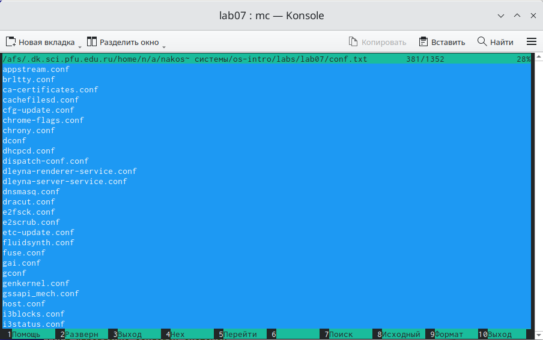
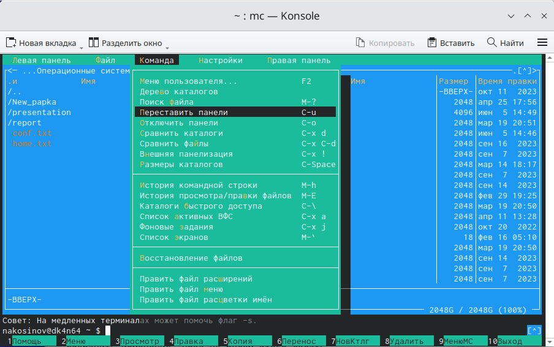
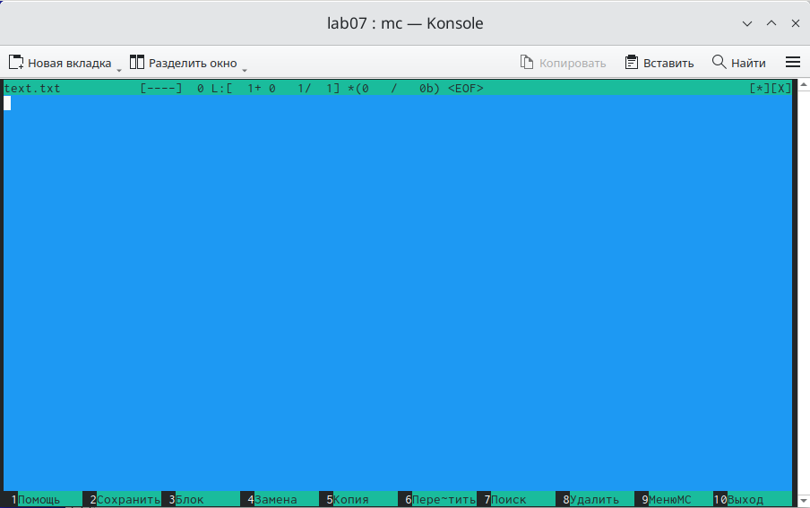

---
## Front matter
title: "РУДН. Операционные системы"
subtitle: "Отчёт по лабораторной работе №7"
author: "Косинов Никита Андреевич, НПМбв-02-20"

## Generic otions
lang: ru-RU
toc-title: "Содержание"

## Bibliography
bibliography: bib/cite.bib
csl: pandoc/csl/gost-r-7-0-5-2008-numeric.csl

## Pdf output format
toc: true # Table of contents
toc-depth: 2
lof: true # List of figures
lot: true # List of tables
fontsize: 12pt
linestretch: 1.5
papersize: a4
documentclass: scrreprt
## I18n polyglossia
polyglossia-lang:
  name: russian
  options:
	- spelling=modern
	- babelshorthands=true
polyglossia-otherlangs:
  name: english
## I18n babel
babel-lang: russian
babel-otherlangs: english
## Fonts
mainfont: PT Serif
romanfont: PT Serif
sansfont: PT Sans
monofont: PT Mono
mainfontoptions: Ligatures=TeX
romanfontoptions: Ligatures=TeX
sansfontoptions: Ligatures=TeX,Scale=MatchLowercase
monofontoptions: Scale=MatchLowercase,Scale=0.9
## Biblatex
biblatex: true
biblio-style: "gost-numeric"
biblatexoptions:
  - parentracker=true
  - backend=biber
  - hyperref=auto
  - language=auto
  - autolang=other*
  - citestyle=gost-numeric
## Pandoc-crossref LaTeX customization
figureTitle: "Рис."
tableTitle: "Таблица"
listingTitle: "Листинг"
lofTitle: "Список иллюстраций"
lotTitle: "Список таблиц"
lolTitle: "Листинги"
## Misc options
indent: true
header-includes:
  - \usepackage{indentfirst}
  - \usepackage{float} # keep figures where there are in the text
  - \floatplacement{figure}{H} # keep figures where there are in the text
---

# Цель работы

Не всегда визуально наглядно и удобно пользоваться терминалом в "чистом" виде. Для решения этой проблемы, не теряя в функциональности, существуют командные оболочки. Одной из таких является **Midnight Commander**

Целью данной работы является ознакомление с **MC**, приобретение практических навыков при работе в этой оболочке с файловой системой компьютера.

# Ход работы

Лабораторная работа выполнена в терминале **OC Linux**, командной оболочке **Midnight Commander** и хостинге хранения проектов **Github**.
Действия по лабораторной работе представлены в следующем порядке:

{#fig:fig width=70%}
1. просмотр информации в командной оболочке;

2. возможности вкладки *Файл*;

3. возможности вкладок *Команда* и *Настройки*;

4. изменение файла с помощью встроенного редактора.

По завершении отчёта, вся рабочая папка отправляется на репозиторий на *github*.

# Просмотр информации в командной оболочке

Прежде чем мы приступим к выполнению задания, просмотрим мануал команды *mc*. Мы увидим пояснение, что перед нами.

{#fig:fig1 width=70%}

*Midnight Commander - это программа, предназначенная для просмотра содержимого каталогов и выполнения основных функций управления файлами в UNIX-подобных операционных системах.*

1. Запустим *mc*. С помощью стрелок и *Enter* откроем на левой панели папку **lab06**, а на правой - **lab07**.

{#fig:fig2 width=70%}

{#fig:fig3 width=70%}

2. Выполним перенос файла **conf.txt** с помощью клавиши *F6* из левой папки в правую. Видим, что слева файл удалился.

{#fig:fig4 width=70%}

{#fig:fig5 width=70%}

3. Исправим ошибку. Скопируем с помощью клавиши *F5* этот файл обратно.

{#fig:fig6 width=70%}

4. Скопируем сразу несколько файлов, выделив их с помощью клавиши *Shift*.

{#fig:fig7 width=70%}

5. С помощью клавиши *F9* перейдём на панель управления. Выберем пункт *Быстрый просмотр* для вывода содержимого выделенного файла.

{#fig:fig8 width=70%}

{#fig:fig9 width=70%}

6. Для того же файла просмотрим информацию о нём, выбрав пункт *Информация*. В частности, оттуда можно получить, например, парва доступа к этому файлу: видим, что для **conf.txt** они выглядят как *-rw-r--r--*.

{#fig:fig10 width=70%}

# Возможности вкладки *Файл*

1. Просмотреть содержимое файла можно клавишей *F3*, а также выбрав подпункт *Просмотр файла* вкладки *Файл*.

{#fig:fig11 width=70%}

2. С помощью клавиши *F4* можно отредактировать файл. Нажимаем *F10*, и **MC** предлагает сохранить изменения. Пока не будем этого делать.

{#fig:fig12 width=70%}

{#fig:fig13 width=70%}

3. С помощью клавиши *F7* (или в пунтке *Создание каталога* вкладки *Файл*) можно создать новую папку.

{#fig:fig14 width=70%}

4. Скопируем файл в эту новую папку. Откроем её на левой панели для подтверждения результата.

{#fig:fig15 width=70%}

# Возможности вкладок *Команда* и *Настройки*

1. Для начала, откроем в правой панели домашнюю папку.

{#fig:fig16 width=70%}

2. С помощью кнопки *F9* перейдём на вкладку *Команда*, пункт *Поиск файла*. Найдём все файлы, начинающиеся на *conf*.

{#fig:fig17 width=70%}

{#fig:fig18 width=70%}

{#fig:fig19 width=70%}

3. Воспользуемся пунктом *Переставить панели*.

{#fig:fig20 width=70%}

{#fig:fig21 width=70%}

4. Пунктом *История командной строки* повторим одну из последних операций (переход в каталог **work**.

{#fig:fig22 width=70%}

{#fig:fig23 width=70%}

5. С помощью *Дерева каталогов* вернёмся в доманшнюю директорию.

{#fig:fig24 width=70%}

{#fig:fig25 width=70%}

6. Щёлкнув по вкладке *Править файл меню*, можно просмотреть структуру контекстного меню, вызываемого кнопкой *F2*.

{#fig:fig26 width=70%}

{#fig:fig27 width=70%}

7. Перейдя по вкладке *Настройки*, можно изменить внешний вид нашего **MC**. Например, можно изменить расположение панелей на горизонтальное, изменить тему на тёмную и вывести размеры файлов.

{#fig:fig28 width=70%}

{#fig:fig29 width=70%}

# Изменение файла с помощью встроенного редактора

1. Создадим новый текстовый файл **text.txt** командой *touch*.

2. Выделим его стрелками и нажмём *F4*. Открылся втсроенный редактор **MC**, и мы видим, что файл пока пуст.

{#fig:fig31 width=70%}

3. Вставим скопированное задание лабораторной работы с помощью сочетания клавиш *Ctrl+Shift+V*.

{#fig:fig32 width=70%}

4. Удалим первую строку сочетанием *Ctrl+Y*.

{#fig:fig33 width=70%}

5. Клавишей *F3* выделим первую строку 4-го задания, вставим с *Enter* строку перед пятым заданием и скопируем туда выделенную строку клавишей *F5*.

{#fig:fig34 width=70%}

6. Выделим строку с 5-м заданием и клавишей *F6* перенесём её в начало четвёртого.

{#fig:fig35 width=70%}

{#fig:fig36 width=70%}

7. Сделаем промежуточное сохранение кнопкой *F2*.

{#fig:fig37 width=70%}

8. Отменим последнюю операцию сочетанием *Ctrl+U*. Строка с пятым заданием вернулась на место.

{#fig:fig38 width=70%}

9. Нажав сочетание *Ctrl+End*, мы перейдём на нижнюю строку файла. Нажав после этого *End*, мы перейдём в конец последней строки. Запишем в конец новый текст. Аналогично работает клавиша *Home*. Запишем новый текст в начало файла.

{#fig:fig39 width=70%}

10. Нажимаем *F10* для выхода из редактора, аыбрав сохранить изменения.

{#fig:fig40 width=70%}

11. Нажимаем *F10* ещё раз, чтобы выйти из **MC**.

# Выводы

Командная оболочка упрощает работу в терминале, не уменьшая при этом функционал терминала. Она имеет несколько режимов работы, позволяет проводить манипуляции с файлами и файловой структурой, просматривать информацию о директориях, изменять права доступа и многое другое.

