---
## Front matter
title: "РУДН. Операционные системы"
subtitle: "Отчёт по лабораторной работе №8"
author: "Косинов Никита Андреевич, НПМбв-02-20"

## Generic otions
lang: ru-RU
toc-title: "Содержание"

## Bibliography
bibliography: bib/cite.bib
csl: pandoc/csl/gost-r-7-0-5-2008-numeric.csl

## Pdf output format
toc: true # Table of contents
toc-depth: 2
lof: true # List of figures
lot: true # List of tables
fontsize: 12pt
linestretch: 1.5
papersize: a4
documentclass: scrreprt
## I18n polyglossia
polyglossia-lang:
  name: russian
  options:
	- spelling=modern
	- babelshorthands=true
polyglossia-otherlangs:
  name: english
## I18n babel
babel-lang: russian
babel-otherlangs: english
## Fonts
mainfont: PT Serif
romanfont: PT Serif
sansfont: PT Sans
monofont: PT Mono
mainfontoptions: Ligatures=TeX
romanfontoptions: Ligatures=TeX
sansfontoptions: Ligatures=TeX,Scale=MatchLowercase
monofontoptions: Scale=MatchLowercase,Scale=0.9
## Biblatex
biblatex: true
biblio-style: "gost-numeric"
biblatexoptions:
  - parentracker=true
  - backend=biber
  - hyperref=auto
  - language=auto
  - autolang=other*
  - citestyle=gost-numeric
## Pandoc-crossref LaTeX customization
figureTitle: "Рис."
tableTitle: "Таблица"
listingTitle: "Листинг"
lofTitle: "Список иллюстраций"
lotTitle: "Список таблиц"
lolTitle: "Листинги"
## Misc options
indent: true
header-includes:
  - \usepackage{indentfirst}
  - \usepackage{float} # keep figures where there are in the text
  - \floatplacement{figure}{H} # keep figures where there are in the text
---

# Цель работы

ОС **Linux** предоставляет возможность редактирование фалов без использования сторонних приложений. Одним из таких средств являются встроенные тесктовые редакторы.

Целью данной работы является ознакомление со встроенным интерактивным редактором **vi** в дистрибудиве **Linux**, получить практические навыки работы с редактором.

# Ход работы

Лабораторная работа выполнена в терминале **OC Linux**, текстовом редакторе **vi** и хостинге хранения проектов **Github**.
Действия по лабораторной работе представлены в следующем порядке:

{#fig:fig width=70%}
1. создание нового файла;

2. редактирование существующего файла.

По завершении отчёта, вся рабочая папка отправляется на репозиторий на *github*.

# Создание нового файла

Перед началом работы создадим новый рабочий каталог **lab08** и перейдём внутрь

1. Создадим новый файл командой *vi*.

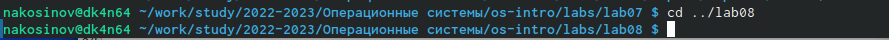{#fig:fig1 width=70%}

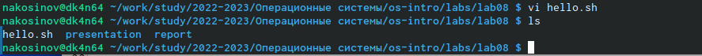{#fig:fig2 width=70%}

2. С помощью клавиши *i* переходим в режим редактирование. Пишем текст в файл.

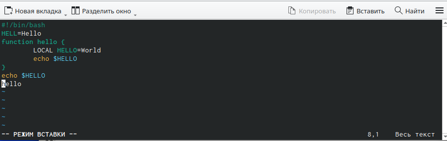{#fig:fig3 width=70%}

3. Клавишей *esc* выходим из режима редактрирования. Вводим команды *:w* для сохранения изменений и *:q* для закрытия файла.

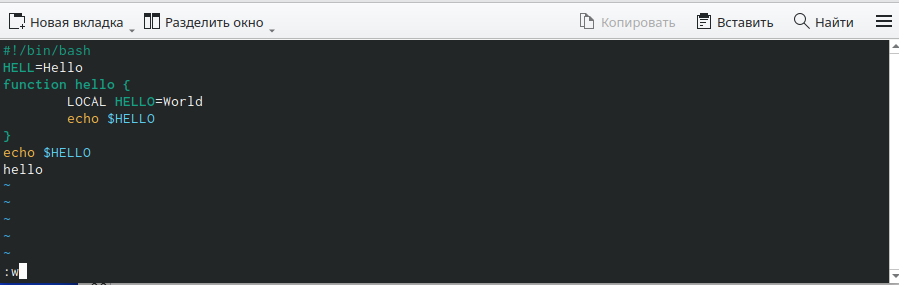{#fig:fig4 width=70%}

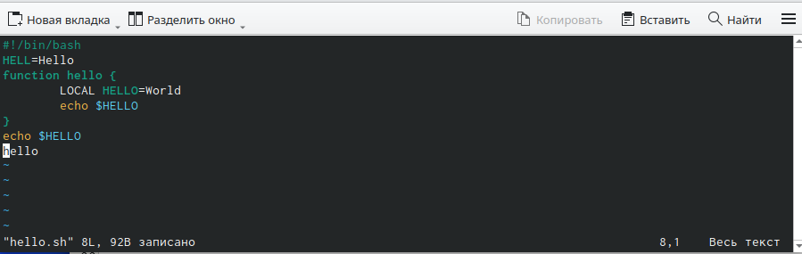{#fig:fig5 width=70%}

{#fig:fig6 width=70%}

4. Делаем файл исполняемым командой *chmod*.

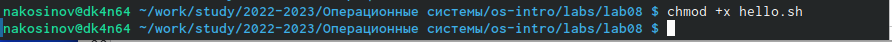{#fig:fig7 width=70%}

# Редактирование существующего файла

1. Вновь откроем созданный в предыдущем задании файл *hello.sh* на редактирование командой *vi*.

2. Нажав последовательно кнопки *2* и *G* (последняя с зажатым *Shift*), перейдём на вторую строку. 

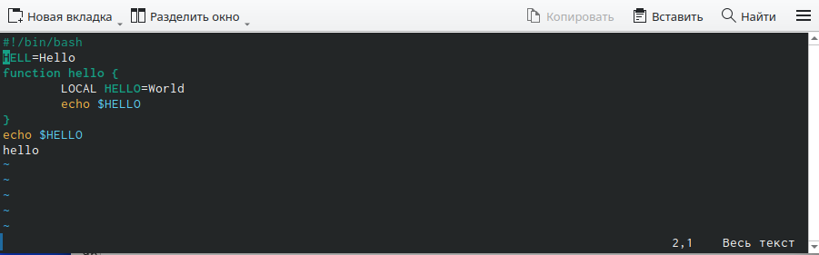{#fig:fig9 width=70%}

3. Нажав клавишу *w*, переходим в конец слова.

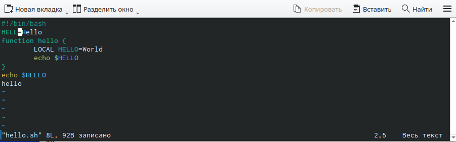{#fig:fig10 width=70%}

4. Клавишей *i* переходим в режим редактирования и изменяем слово **HELL** на **HELLO**. Сохраняем изменения.

{#fig:fig11 width=70%}

5. Нажав *4G*, перейдём в начало четвёртой строки. После, нажав *dw*, удалим первое слово: **LOCAL**.

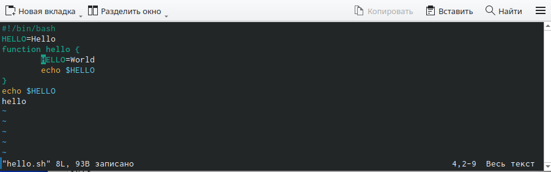{#fig:fig12 width=70%}

6. Переходим в режим вставки и пишем слово **Local**.

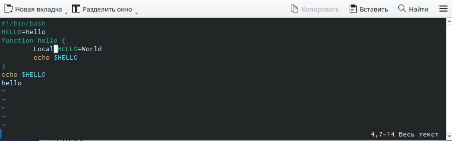{#fig:fig13 width=70%}

7. Кнопкой *G* переходим на последнюю строку и командой *:7t8* копируем 7ю строку после 8й.

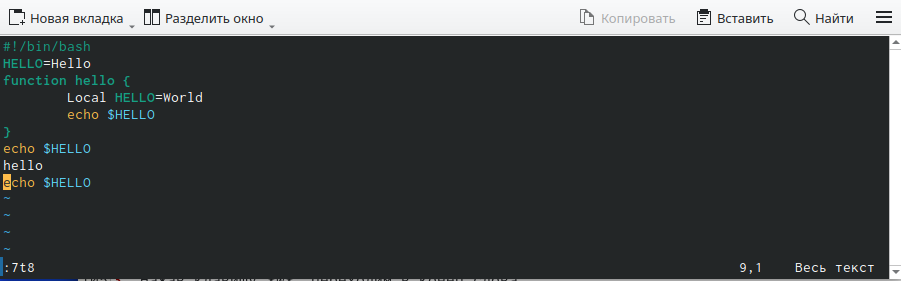{#fig:fig14 width=70%}

8. Удалим последнюю строку (с номером 9) командой *:9d*.

{#fig:fig15 width=70%}

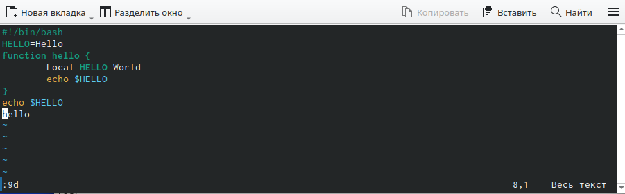{#fig:fig16 width=70%}

9. Клавишей *u* отменим последнее изменение - вернём 9-ю строку на место. Заметим, что **vi** подписывает, какое изменение отменено, и как давно оно было сделано.

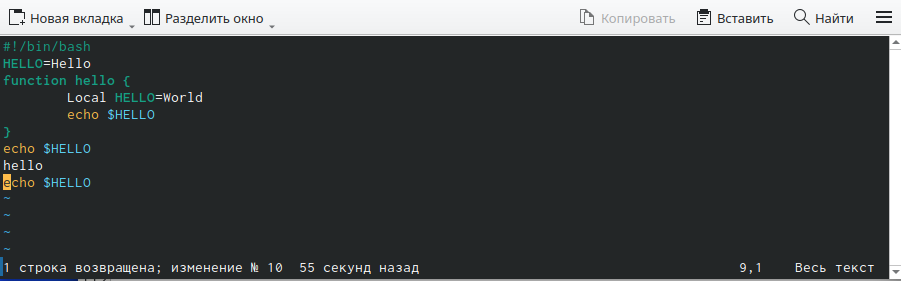{#fig:fig17 width=70%}

10. Выйдем из редактора командой *:wq* с сохранением изменений. Командой *cat* убедимся, что изменения сохранены.

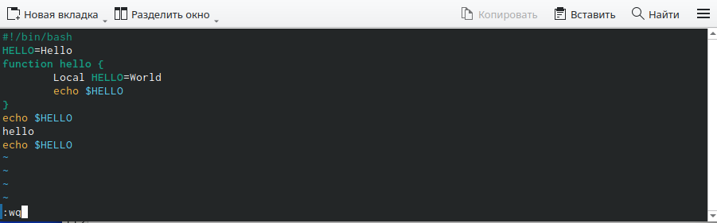{#fig:fig18 width=70%}

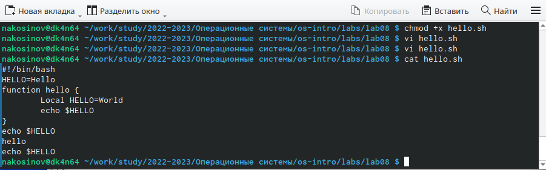{#fig:fig19 width=70%}

# Выводы

Встроенный текстовый редактор **vi** имеет множество функций по редактированию текста. Множество команд позволяют быстро и без использования мыши изменять текст, упрощают навигацию по файлу и пр.

