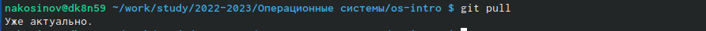
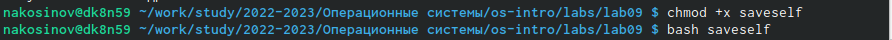
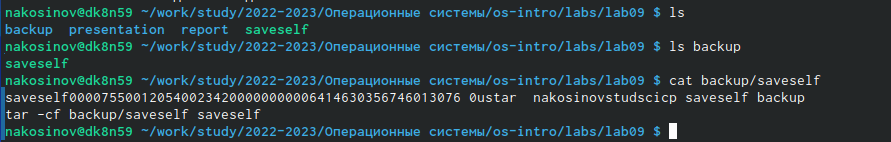
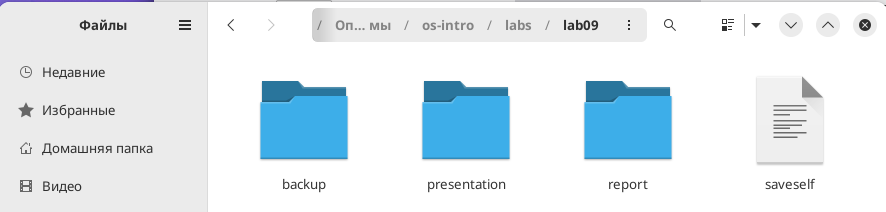
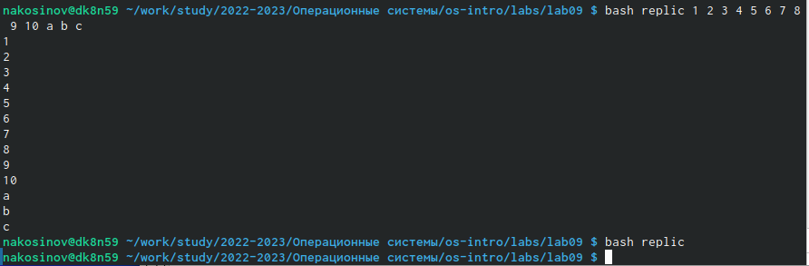
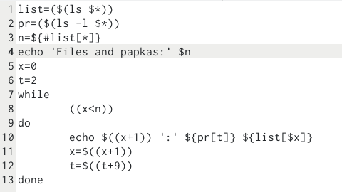
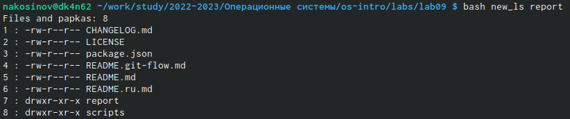
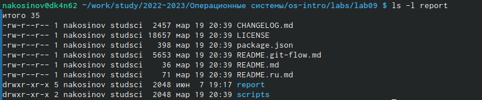

---
## Front matter
title: "РУДН. Операционные системы"
subtitle: "Отчёт по лабораторной работе №9"
author: "Косинов Никита Андреевич, НПМбв-02-20"

## Generic otions
lang: ru-RU
toc-title: "Содержание"

## Bibliography
bibliography: bib/cite.bib
csl: pandoc/csl/gost-r-7-0-5-2008-numeric.csl

## Pdf output format
toc: true # Table of contents
toc-depth: 2
lof: true # List of figures
lot: true # List of tables
fontsize: 12pt
linestretch: 1.5
papersize: a4
documentclass: scrreprt
## I18n polyglossia
polyglossia-lang:
  name: russian
  options:
	- spelling=modern
	- babelshorthands=true
polyglossia-otherlangs:
  name: english
## I18n babel
babel-lang: russian
babel-otherlangs: english
## Fonts
mainfont: PT Serif
romanfont: PT Serif
sansfont: PT Sans
monofont: PT Mono
mainfontoptions: Ligatures=TeX
romanfontoptions: Ligatures=TeX
sansfontoptions: Ligatures=TeX,Scale=MatchLowercase
monofontoptions: Scale=MatchLowercase,Scale=0.9
## Biblatex
biblatex: true
biblio-style: "gost-numeric"
biblatexoptions:
  - parentracker=true
  - backend=biber
  - hyperref=auto
  - language=auto
  - autolang=other*
  - citestyle=gost-numeric
## Pandoc-crossref LaTeX customization
figureTitle: "Рис."
tableTitle: "Таблица"
listingTitle: "Листинг"
lofTitle: "Список иллюстраций"
lotTitle: "Список таблиц"
lolTitle: "Листинги"
## Misc options
indent: true
header-includes:
  - \usepackage{indentfirst}
  - \usepackage{float} # keep figures where there are in the text
  - \floatplacement{figure}{H} # keep figures where there are in the text
---

# Цель работы

Основой пользования ЭВМ и его работы явлются программы - блоки последовательно выполняемых простейших команд. Мы сталкивались ранее с написанием простейших команд и конвейеров в терминале. Но что делать, если нам нужно выполнить множество одинаковых, или зависящих от условия команд, или чтобы они выполнялись автоматически?

Оболочка ОС **Linux** позволяет базово программировать прямиком в терминале и даже сохранять блоки команд в текстовых, но исполняемых файлах. Цель данной работы - познакомиться с основами, предлагаемыми терминалом **Linux** для программирования.

# Ход работы

Лабораторная работа выполнена в терминале **OC Linux**, командная оболочка **bash** и хостинге хранения проектов **Github**.
Действия по лабораторной работе представлены в следующем порядке:

1. написание простейшего скрипта;

2. написание командного файла, обрабатывающего аргументы;

3. написание командного файла - аналог команды *ls*;

4. написание командного файла, вычисляющего количество файлов по формату.

По завершении отчёта, вся рабочая папка отправляется на репозиторий на *github*.

# Написание простейшего скрипта

Перед началом работы создадим новый рабочий каталог **lab09** и перейдём внутрь. Также не забываем синхронизироваться с нашим **Git**.

{#fig:fig1 width=70%}

Первое задание состоит в том, чтобы написать скрипт, копирующий архив себя в папку **backup**.

1. Создадим новый текстовый файл командой *touch*. Назовём его *saveself*. Откроем его с помощью *gedit* на запись.

{#fig:fig2 width=70%}

2. Введём последовательность команд. Сначала скопируем файл *saveself* в нужную папку, затем скопированный файл заархивируем с помощью команды *tar*. Получим следующий код:

'''
cp saveself backup
tar -cf backup/saveself saveself
'''

3. Сохраним файл, сделаем его исполняемым командой *chmod* и вызовем с помощью *bash*. 

{#fig:fig3 width=70%}

4. Получим требуемый результат.

{#fig:fig4 width=70%}

{#fig:fig5 width=70%}

{#fig:fig6 width=70%}

# Написание командного файла, обрабатывающего аргументы

Второе задание: написать командный файл, распечатывающий последовательно все введённые аргументы. Сложность задания в том, что аргументов может быть более 10

1. Создаём новый текстовый файл *replic* и открываем его на редактирование.

{#fig:fig7 width=70%}

2. Идея решения состоит в том, чтобы пройтись циклом *for* по всей строке аргументов, которая воспринимается циклом как массив. Напишем следующий код:

'''
	for s in $*
		do echo $s
	done
'''

3. Запустим скрипт, введя много переменных и 0 переменных.

{#fig:fig8 width=70%}

4. Результат удовлетворительный.

# Написание командного файла - аналог команды *ls*

Третье задание состоит в том, чтобы написать командный файл, выводящий список файлов и каталогов данного с указанием прав доступа.

1. Создаём файл *new_ls*.

2. Записываем в него следующий код. Идея состоит в том, чтобы сохранить список файлов, посчитать их количество, а далее вевести только названия и права доступа.

{#fig:fig12 width=70%}

3. Проверяем полученный результат.

{#fig:fig9 width=70%}

4. Сравниваем его со стандартной функцией *ls -l*

{#fig:fig10 width=70%}

# Написание командного файла, вычисляющего количество файлов по формату

Четвёртая задача заключается в написании файла, принимающему на вход 2 аргумента: путь к директории и формат файлов, количество которых нужно посчитать.

1. Создаём файл *format*

2. Записываем туда код 

'''
list=($(find $1 -name \"\*.$2\" -print))
echo $list
n=${list[*]}
echo 'Files of format' .$2 '=' $n
'''

# Выводы

Для работы с операционной и файловой системой очень помогает оболочка командной строки *bash*. При этом, оболочка позволяет сохранять блоки команд в единый программный файл, что сильно упрощает работу с ним.

