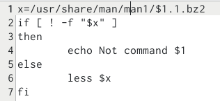
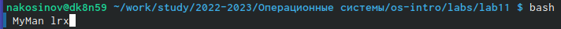
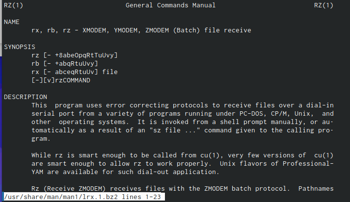
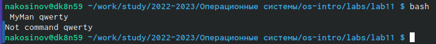
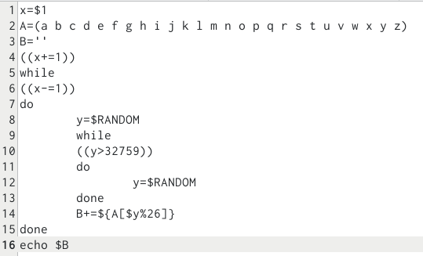
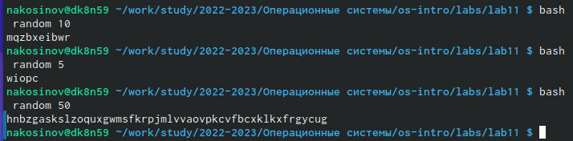

---
## Front matter
title: "РУДН. Операционные системы"
subtitle: "Отчёт по лабораторной работе №11"
author: "Косинов Никита Андреевич, НПМбв-02-20"

## Generic otions
lang: ru-RU
toc-title: "Содержание"

## Bibliography
bibliography: bib/cite.bib
csl: pandoc/csl/gost-r-7-0-5-2008-numeric.csl

## Pdf output format
toc: true # Table of contents
toc-depth: 2
lof: true # List of figures
lot: true # List of tables
fontsize: 12pt
linestretch: 1.5
papersize: a4
documentclass: scrreprt
## I18n polyglossia
polyglossia-lang:
  name: russian
  options:
	- spelling=modern
	- babelshorthands=true
polyglossia-otherlangs:
  name: english
## I18n babel
babel-lang: russian
babel-otherlangs: english
## Fonts
mainfont: PT Serif
romanfont: PT Serif
sansfont: PT Sans
monofont: PT Mono
mainfontoptions: Ligatures=TeX
romanfontoptions: Ligatures=TeX
sansfontoptions: Ligatures=TeX,Scale=MatchLowercase
monofontoptions: Scale=MatchLowercase,Scale=0.9
## Biblatex
biblatex: true
biblio-style: "gost-numeric"
biblatexoptions:
  - parentracker=true
  - backend=biber
  - hyperref=auto
  - language=auto
  - autolang=other*
  - citestyle=gost-numeric
## Pandoc-crossref LaTeX customization
figureTitle: "Рис."
tableTitle: "Таблица"
listingTitle: "Листинг"
lofTitle: "Список иллюстраций"
lotTitle: "Список таблиц"
lolTitle: "Листинги"
## Misc options
indent: true
header-includes:
  - \usepackage{indentfirst}
  - \usepackage{float} # keep figures where there are in the text
  - \floatplacement{figure}{H} # keep figures where there are in the text
---

# Цель работы

Основой пользования ЭВМ и его работы явлются программы - блоки последовательно выполняемых простейших команд. Мы сталкивались ранее с написанием простейших команд и конвейеров в терминале. Но что делать, если нам нужно выполнить множество одинаковых, или зависящих от условия команд, или чтобы они выполнялись автоматически?

Оболочка ОС **Linux** позволяет базово программировать прямиком в терминале и даже сохранять блоки команд в текстовых, но исполняемых файлах. Цель данной работы - познакомиться с основами, предлагаемыми терминалом **Linux** для программирования.

# Ход работы

Лабораторная работа выполнена в терминале **OC Linux**, командная оболочка **bash** и хостинге хранения проектов **Github**.
Действия по лабораторной работе представлены в следующем порядке:

1. написание файла-"семафор";

2. реализация команды *man*;

3. написание командного файла, создающего случайную строку;

По завершении отчёта, вся рабочая папка отправляется на репозиторий на *github*.

# Написание файла-"семафор"

Перед началом работы создадим новый рабочий каталог **lab09** и перейдём внутрь. Также не забываем синхронизироваться с нашим **Git**.

# Реализация команды *man*

1. Создаём файл *MyMan*.

2. Пишем туда следующий код:

{#fig:fig1 width=70%}

3. Проверяем результат с существующей командой.

{#fig:fig2 width=70%}

{#fig:fig3 width=70%}

4. Проверяем результат с несуществующей командой.

{#fig:fig4 width=70%}

# Написание командного файла, создающего случайную строку

1. Создаём файл *random*.

2. Пишем туда следующий код. Обратим внимание, что мы рассматриваем случайные числа от 0 до 32759, т.к. это делится на 26, и, следовательно, даёт равновероятное выпадение буквы.

{#fig:fig5 width=70%}

3. Проверяем результат с несколькими вариантами введённого числа.

{#fig:fig6 width=70%}

# Выводы

Для работы с операционной и файловой системой очень помогает оболочка командной строки *bash*. При этом, оболочка позволяет сохранять блоки команд в единый программный файл, что сильно упрощает работу с ним.

