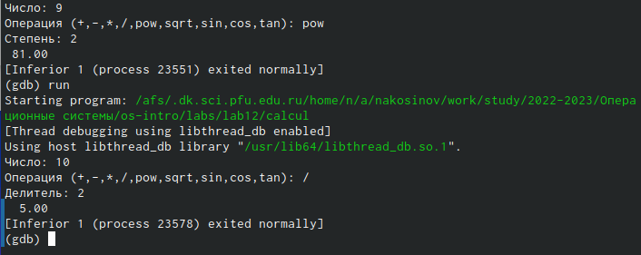

---
## Front matter
title: "РУДН. Операционные системы"
subtitle: "Отчёт по лабораторной работе №12"
author: "Косинов Никита Андреевич, НПМбв-02-20"

## Generic otions
lang: ru-RU
toc-title: "Содержание"

## Bibliography
bibliography: bib/cite.bib
csl: pandoc/csl/gost-r-7-0-5-2008-numeric.csl

## Pdf output format
toc: true # Table of contents
toc-depth: 2
lof: true # List of figures
lot: true # List of tables
fontsize: 12pt
linestretch: 1.5
papersize: a4
documentclass: scrreprt
## I18n polyglossia
polyglossia-lang:
  name: russian
  options:
	- spelling=modern
	- babelshorthands=true
polyglossia-otherlangs:
  name: english
## I18n babel
babel-lang: russian
babel-otherlangs: english
## Fonts
mainfont: PT Serif
romanfont: PT Serif
sansfont: PT Sans
monofont: PT Mono
mainfontoptions: Ligatures=TeX
romanfontoptions: Ligatures=TeX
sansfontoptions: Ligatures=TeX,Scale=MatchLowercase
monofontoptions: Scale=MatchLowercase,Scale=0.9
## Biblatex
biblatex: true
biblio-style: "gost-numeric"
biblatexoptions:
  - parentracker=true
  - backend=biber
  - hyperref=auto
  - language=auto
  - autolang=other*
  - citestyle=gost-numeric
## Pandoc-crossref LaTeX customization
figureTitle: "Рис."
tableTitle: "Таблица"
listingTitle: "Листинг"
lofTitle: "Список иллюстраций"
lotTitle: "Список таблиц"
lolTitle: "Листинги"
## Misc options
indent: true
header-includes:
  - \usepackage{indentfirst}
  - \usepackage{float} # keep figures where there are in the text
  - \floatplacement{figure}{H} # keep figures where there are in the text
---

# Цель работы

Познакомиться с основными принципами написания, отладки, тестирования приложения в **ОС Linux** на примере разработки приложения "Простейший калькулятор" на языке **С**.

# Ход работы

Лабораторная работа выполнена в терминале **OC Linux**, командной оболочке **bash**, отладчике **gdb** и хостинге хранения проектов **Github**.

Действия по лабораторной работе представлены в виде последовательных шагов.

По завершении отчёта, вся рабочая папка отправляется на репозиторий на *github*.

# Написание программы "Простейший калькулятор"

Перед началом работы создадим новый рабочий каталог **lab12** и перейдём внутрь. Также не забываем синхронизироваться с нашим **Git**.

1. В первую очередь перейдём в рабочую директорию и создадим необходимые файлы.

{#fig:fig1 width=70%}

2. Напишем необходимый код для нашего приложения.

{#fig:fig2 width=70%}

3. Сконфигурируем написанные программы с помощью компилятора **gcc**.

{#fig:fig3 width=70%}

4. Увидим, что после компиляции появились соответствующие исполняемые файлы.

{#fig:fig4 width=70%}

5. Создадим конфигурирующий *Makefile*.

{#fig:fig5 width=70%}

6. Пропишем в *Makefile* следующий код:

{#fig:fig6 width=70%}

Здесь синим подсвечены цели, после двоеточия указаны зависимости для этих целей, далее идут команды.

7. Запустим отладчик **gdb**

{#fig:fig7 width=70%}

8. Запустим программу внутри отладчика для проверки корректности её работы.

{#fig:fig8 width=70%}

9. Запускаем программу несколько раз, чтобы проверить работоспособность каждой функции нашего калькулятора. Запустить пришлось 9 раз, по одному на каждую команду, причём для операции деления дважды, чтобы проверить обработку исключения "деление на ноль".

{#fig:fig9 width=70%}

10. Поставим точку останова командой *break* на 21-ю строку файла *calculate.c*, соответствующую моменту ввода вычитаемого. Выбираем ответ *y* (yes).

{#fig:fig10 width=70%}

11. Проверим наличие точки останова, выведя информацию о всех таких командой *info breakpoints*.

{#fig:fig11 width=70%}

12. Удалим созданную точку остановы командой *delete*. Снова выведем информацию о точках, чтобы убедиться в корректности выполненного удаления.

{#fig:fig12 width=70%}

13. Выход из отладчика производится командой *quit(q)*.

{#fig:fig13 width=70%}

14. Проанализируем код программы, используя утилиту *splint*.

{#fig:fig14 width=70%}

15. Видим, что эта утилита нашла 15 ошибок. Координаты ошибки даются после названия файла, далее идёт описание ошибки. Например, та, что идёт первой относится к связанному файлу *calculate.h*: 7 строка, 37 символ, ошибка связана с перемнной *Operation[4]*. **Splint** утверждает, что бессмысленно указывать размер константы.

# Выводы

Мы познакомились с отладчиком приложений **gdb** и более требовательным **splint**, протестировали написанное приложение "Простейший калькулятор", научились ставить точки остановы.

